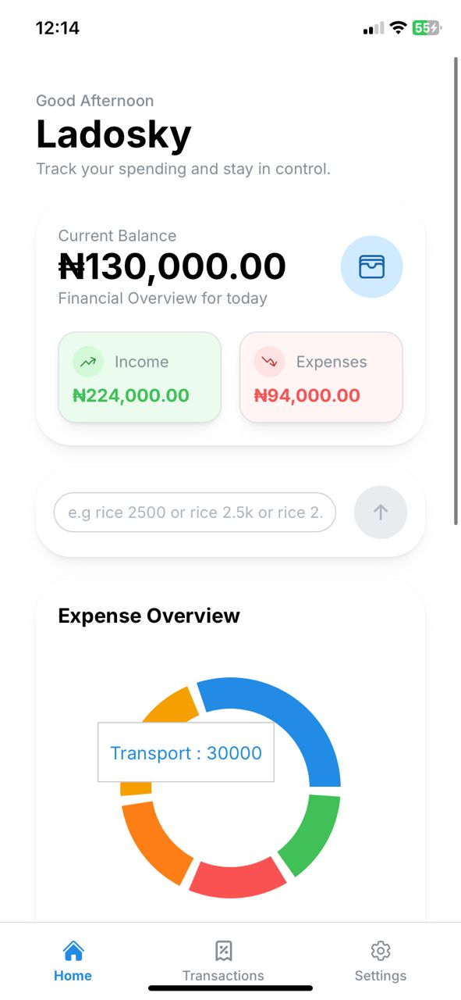

# KudiTrack App 💸

KudiTrack is a modern full-stack personal finanace tracker built to help users manage income and expenses effortlessly. It provides secure authentication, smart transaction categorization, quick transaction input, and a clean mobile first interface.

## 📸Screenshots
### Light Mode Layouts

    
    
    
    

### Dark Mode Layouts

    
    
    

## ⚡Core Features

*   **Authentication**

> User Registration
> Email Verification
> Login and Logout
> Forgot Password
> Password Reset
> Secure HTTP-only cookie authentication

* **Transactions**

> Add income and expenses
> Edit transactions
> Delete Transactions
> Clear All transactions
> search transactions
> Filter by income and expenses
> Group transactions by date
> Quick natural langauge transaction input e.g rice 2500, salary 1.5m, uber 5k

* **Smart Categorization**

Automaticall detects categories such as:

> Food
> Transport
> Bills
> Shopping
> Entertainment
> Health
> Education
> Income
> Appliances
> Other

* **User Experiences**

> Loading Skeletons
> Responsive Designs
> Notifications
> Confirmation dialogs
> Framer Motion animations
> Mode switch supports(Dark & Light)

# ⚒️ Tech Stack
## Frontend

> React
> Typescript
> Vite
> Mantine UI
> Framer Motion
> React Router
> Axios

## Backend
> Node.js
> Zod
> Nodemailer
> Express rate limiter
> MongoDB
> JWT Authentication
> Cookie parser
> Helmet
> TypeScript
> Express

# 🔐 Security

> HTTP-only cookies
> Password hashing with bcrypt
> JWT Authentication
> Helmet security headers
> Request rate limiting
> Zod input validation
> Protected routes
> Production-aware cookie settings

# 🌏 Deployment

## Frontend
> Vercel

## Backend
> Railway

## Database 
> MongoDB Atlas

## Domain
> 🔗Frontend: https://app.kuditrack.com.ng

> 🔗Backend: https://api.kuditrack.com.ng

## 🚀 Future plans .V2

* [ ] AI transactions categorization
* [ ] Insights and analytics
* [ ] Charts and statistics
* [ ] Budgeting system
* [ ] Recurring transactions
* [ ] Export functionality
* [ ] Multi-format data export options (CSV/PDF ledgers).

# 📌 Status
Kuditrack v1 is production-ready and live.

Built with love using react, typescript, node.js and MongoDB

